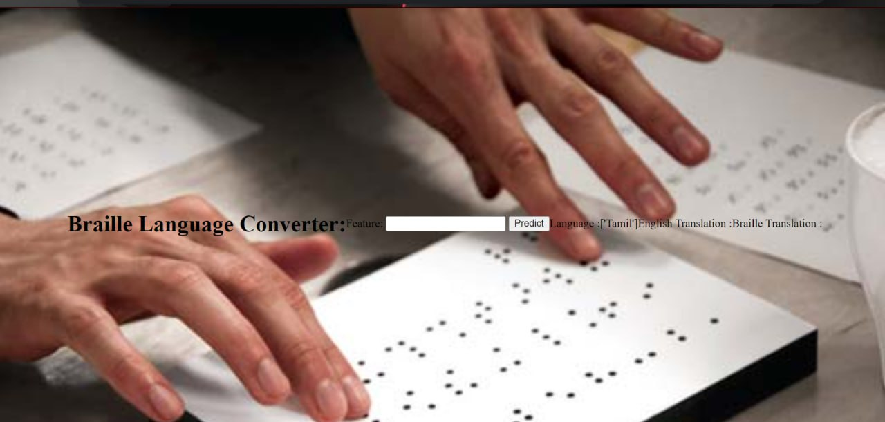

# Braille Translator

Braille is a type of font used by blind people, where characters are represented by patterns of raised dots. The reading is accomplished by feeling the dots with one’s fingertips.
This is a simple tool for converting plain text of any language to Braille. It provides a web interface where users can input text for transcription. It also has the ability to automatically detect the source language of the text and transcribe it accordingly.

# Overview
- [Installation](#installation)
- [Usage](#usage)
- [Data](#data)
- [Training](#training)
- [Evaluation](#evaluation)
- [Results](#results)
- [Contributing](#contributing)
- [License](#license)

# Installation

1. Read the csv file https://raw.githubusercontent.com/amankharwal/Website-data/master/dataset.csv
2. Read [README](Backend.md) for backend
3. Read [README](templates/Frontend.md) for frontend
4. Install language translator using !pip install googletrans

# Usage

Once the servers are running, navigate to http://localhost:5000 in your browser to access the web interface. Input your text and select a language and grade, then click the "Translate" button to see the result in braille.

### Backend
The backend is a Python server built with FlaskAPI. It provides many endpoints like:

- `/transcriptor`: Accepts text input predict the source language convert to English language , and returns the corresponding braille output.

The server uses googletrans to convert input language to English language and use function "english2Braiile" for transcription.

## Frontend

The frontend is a HTML website. It provides a simple interface for inputting text.

The application uses the 'Flask' library to communicate with the backend server.

# Data

Data set used for model training is given in below link:
https://raw.githubusercontent.com/amankharwal/Website-data/master/dataset.csv

# Training

Training model used : MultinomialNB

# Evaluation

Accuracy of used model is more than 95% .

# Results

# Contributing

Sanjeevani Vishnu Bhopre - Documentation and Testing

Abhishek Kumar - Development and Coding

Aryan Kumar - User Interface (UI/UX) Design and Accessibility

